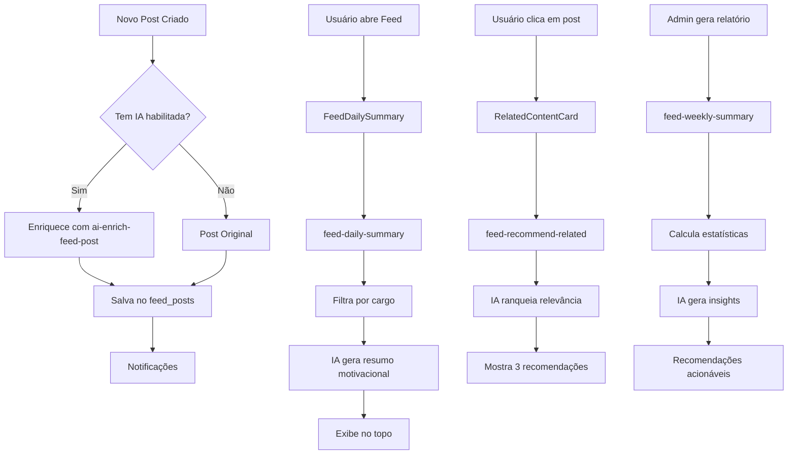

# Feed Inteligente com GiraBot 🤖

## 📋 Visão Geral

O GiraBot é o assistente motivacional da Cresci e Perdi que torna o Feed verdadeiramente inteligente, oferecendo recomendações personalizadas, resumos automáticos e interações naturais com os colaboradores.

## 🧠 Funcionalidades de IA

### 1. Resumo Diário Personalizado

**Edge Function:** `feed-daily-summary`

**O que faz:**
- Gera resumo motivacional das novidades das últimas 24 horas
- Personaliza mensagens com o nome do usuário
- Filtra conteúdo por cargo (respeita target_roles)
- Destaca os posts mais importantes
- Tom animado e encorajador da marca

**Como usar:**
```typescript
const { data } = await supabase.functions.invoke('feed-daily-summary', {
  body: { user_id: userId }
});
```

**Exemplo de resposta:**
```
🎯 Opa, Maria! Hoje temos 2 novidades quentinhas pra você! 

O novo treinamento de Bioimpedância vai te deixar expert e a 
campanha do mês já começou. Bora conferir e arrasar! 💪
```

**Componente UI:** `<FeedDailySummary />` (já integrado no topo do Feed)

---

### 2. Resumo Semanal com Insights

**Edge Function:** `feed-weekly-summary`

**O que faz:**
- Análise completa dos últimos 7 dias
- Estatísticas por tipo de conteúdo
- Identifica post mais popular
- IA gera insights estratégicos
- Recomendações para próxima semana

**Como usar:**
```typescript
const { data } = await supabase.functions.invoke('feed-weekly-summary');
```

**Retorna:**
```json
{
  "summary": "📆 Resumo Semanal — Feed Cresci e Perdi\n...",
  "ai_insights": "Insights profundos do GiraBot sobre engajamento",
  "stats": {
    "total": 8,
    "by_type": { "training": 3, "campaign": 2 },
    "engagement": 82,
    "top_post": { ... }
  }
}
```

**Componente UI:** `<FeedWeeklySummary />` (aba "Resumo" no Admin)

---

### 3. Recomendações de Conteúdo Relacionado

**Edge Function:** `feed-recommend-related`

**O que faz:**
- Identifica posts relacionados por tipo e contexto
- IA analisa relevância e complementaridade
- Ranqueia por score de relevância
- Gera explicações motivacionais
- Considera sequência lógica de aprendizado

**Mapeamento de relacionamentos:**
```typescript
{
  'training': ['manual', 'checklist', 'media'],
  'checklist': ['training', 'manual'],
  'manual': ['training', 'checklist', 'media'],
  'campaign': ['recognition', 'training'],
  'idea': ['manual', 'training'],
  // ...
}
```

**Como usar:**
```typescript
const { data } = await supabase.functions.invoke('feed-recommend-related', {
  body: { 
    post_id: 'uuid-do-post',
    user_id: 'uuid-do-usuario'
  }
});
```

**Retorna:**
```json
{
  "recommendations": [
    {
      "id": "...",
      "title": "Manual de Bioimpedância",
      "type": "manual",
      "reason": "📖 Guia prático relacionado",
      "relevance_score": 95
    }
  ]
}
```

**Componente UI:** `<RelatedContentCard />` (exibido em cada post)

---

### 4. Análise de Engajamento

**Edge Function:** `analyze-feed-engagement`

**O que faz:**
- Identifica posts de alto impacto
- Calcula métricas de engajamento
- IA sugere posts para fixar
- Recomenda melhorias de conteúdo
- Detecta tendências

**Componente UI:** `<FeedEngagementDashboard />` (aba "Analytics" no Admin)

---

### 5. GiraBot Chat Integrado

**Edge Function:** `girabot-tutor` (atualizado)

**Novas capacidades:**
- Responde perguntas sobre novidades do Feed
- Contexto automático de posts recentes
- Tom motivacional da marca
- Filtragem por cargo do usuário

**Perguntas sobre o Feed:**
- "O que tem de novo?"
- "Tem algo pra mim hoje?"
- "Quais são as novidades?"
- "O que mudou desde ontem?"

**Detecção automática:**
O GiraBot detecta palavras-chave como:
`novo, novidade, feed, atualiza, hoje, notícia, o que tem`

E automaticamente busca e inclui contexto dos últimos posts relevantes.

---

## 🎨 Estilo de Comunicação

O GiraBot usa o tom da marca Cresci e Perdi:

✅ **Fazer:**
- "Bora", "Vamos lá", "Você consegue"
- Tom positivo e energético
- Emojis relevantes (máx. 3)
- Foco em conquistas e evolução
- Linguagem acessível com "você"

❌ **Evitar:**
- Linguagem formal ou técnica demais
- Muitos emojis (poluição visual)
- Tom negativo ou desmotivador
- Respostas muito longas

---

## 🔧 Configuração

### Variáveis de Ambiente

```bash
# Obrigatória para todas as funcionalidades de IA
LOVABLE_API_KEY=<auto-provisionada>
```

### Modelos Usados

- **Padrão:** `google/gemini-2.5-flash`
- **Rápido e eficiente** para resumos e recomendações
- **Temperatura:** 0.7 (criativo mas consistente)

---

## 📊 Fluxo de Dados



---

## 🎯 Casos de Uso

### 1. Onboarding de Novos Colaboradores
Quando um novo colaborador entra:
- GiraBot resume conteúdo relevante para o cargo
- Recomenda sequência de treinamentos
- Destaca manuais e checklists essenciais

### 2. Manutenção de Engajamento
Para colaboradores ativos:
- Resumo diário com novidades personalizadas
- Recomendações de conteúdo complementar
- Destaque de campanhas e reconhecimentos

### 3. Gestão Estratégica
Para gestores e admins:
- Resumo semanal com métricas
- Insights de IA sobre engajamento
- Sugestões de conteúdo para fixar
- Identificação de gargalos de comunicação

---

## 🚀 Próximas Evoluções

**Roadmap sugerido:**

1. **Notificações Inteligentes**
   - IA determina melhor momento para notificar
   - Agrupa notificações por prioridade
   - Personaliza frequência por usuário

2. **Predição de Engajamento**
   - IA prevê performance de posts antes de publicar
   - Sugere melhorias em título e descrição
   - Recomenda melhor horário de publicação

3. **Auto-curadoria**
   - IA sugere posts para arquivo
   - Identifica conteúdo desatualizado
   - Recomenda atualizações necessárias

4. **Segmentação Inteligente**
   - IA sugere target_roles automaticamente
   - Personaliza descrição por cargo
   - Cria versões adaptadas do mesmo conteúdo

---

## 📝 Logs e Monitoramento

Todos os edge functions geram logs detalhados:

```
📊 Generating daily feed summary for user: uuid
🔔 User asking about feed updates
✅ AI daily summary generated
💡 GiraBot recomenda: [recommendations]
```

**Verificar logs:**
Supabase Dashboard > Edge Functions > Logs

---

## 🐛 Troubleshooting

### GiraBot não responde sobre Feed
- Verificar se usuário usou palavras-chave
- Confirmar que há posts nas últimas 24h
- Verificar filtro por cargo (target_roles)

### Recomendações vazias
- Confirmar que existem posts relacionados
- Verificar mapeamento de tipos em `RELATED_TYPES`
- Testar com `LOVABLE_API_KEY` configurada

### Resumo diário não aparece
- Verificar se há novos posts (últimas 24h)
- Confirmar que usuário tem acesso (target_roles)
- Checar componente `<FeedDailySummary />` no Feed

---

## 💡 Boas Práticas

1. **Sempre teste com usuários de diferentes cargos**
   - Conteúdo segmentado deve ser testado por cargo
   
2. **Monitore uso de créditos da IA**
   - Resumos diários consomem créditos
   - Considere cache para resumos idênticos

3. **Valide tone of voice**
   - GiraBot deve ser consistente com a marca
   - Revisar prompts periodicamente

4. **Analise feedback dos usuários**
   - Recomendações relevantes?
   - Resumos úteis?
   - Ajustar prompts conforme necessário

---

**Desenvolvido para Cresci e Perdi**  
Versão 2.0 - Feed Inteligente com GiraBot 🤖
