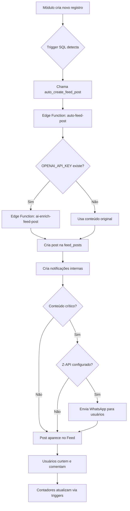

# Sistema de Feed Unificado

## 📋 Visão Geral

O Feed Unificado é uma timeline institucional que centraliza todas as atualizações da intranet em um só lugar, permitindo que colaboradores acompanhem novidades de todos os módulos com interações sociais (likes e comentários).

## 🎯 Funcionalidades

### Posts Automáticos
Cada módulo da intranet gera posts automaticamente:

| Módulo | Evento | Tipo de Post | Ícone |
|--------|--------|--------------|-------|
| Treinamentos | Novo curso publicado | `training` | 🎓 |
| Checklists | Nova rotina (alta prioridade) | `checklist` | ✅ |
| Manuais | Novo manual publicado | `manual` | 📚 |
| Campanhas | Nova campanha ativa | `campaign` | 🎯 |
| Reconhecimento | Novo destaque | `recognition` | 🏆 |
| Ideias | Ideia implementada | `idea` | 💡 |
| Mídias | Mídia em destaque | `media` | 🎬 |
| Pesquisas | Nova pesquisa ativa | `survey` | 📊 |
| Comunicados | Novo comunicado | `announcement` | 📢 |

### Interações Sociais
- **Curtidas**: Duplo toque ou botão de like
- **Comentários**: Thread de comentários com notificações
- **Posts Fixados**: Admins podem fixar posts importantes no topo
- **Notificações**: Usuários recebem alertas de novos posts

## 🏗️ Arquitetura

### 1. Tabelas do Banco de Dados

#### `feed_posts`
```sql
- id: UUID (PK)
- type: TEXT (training, checklist, manual, campaign, recognition, idea, media, survey, announcement)
- title: TEXT
- description: TEXT
- module_link: TEXT (opcional)
- media_url: TEXT (opcional)
- created_by: UUID (FK auth.users)
- pinned: BOOLEAN
- likes_count: INTEGER
- comments_count: INTEGER
- created_at: TIMESTAMPTZ
- updated_at: TIMESTAMPTZ
```

#### `feed_post_likes`
```sql
- id: UUID (PK)
- post_id: UUID (FK feed_posts)
- user_id: UUID (FK auth.users)
- created_at: TIMESTAMPTZ
- UNIQUE(post_id, user_id)
```

#### `feed_post_comments`
```sql
- id: UUID (PK)
- post_id: UUID (FK feed_posts)
- user_id: UUID (FK auth.users)
- comment: TEXT
- created_at: TIMESTAMPTZ
- updated_at: TIMESTAMPTZ
```

### 2. Triggers SQL Automáticos

Cada módulo tem um trigger que detecta novos registros e chama automaticamente a edge function:

```sql
-- Exemplo: Trigger para treinamentos
CREATE OR REPLACE FUNCTION public.on_training_created()
RETURNS TRIGGER AS $$
BEGIN
  IF NEW.active = true THEN
    PERFORM auto_create_feed_post(
      'training',
      '🎓 Novo Treinamento: ' || NEW.title,
      COALESCE(NEW.description, 'Acesse agora!'),
      '/treinamentos',
      NULL,
      NULL
    );
  END IF;
  RETURN NEW;
END;
$$ LANGUAGE plpgsql;
```

### 3. Edge Functions

#### `auto-feed-post`
Edge function principal que:
1. Recebe dados do trigger SQL
2. Opcionalmente enriquece o conteúdo com IA (se OPENAI_API_KEY estiver configurada)
3. Cria o post na tabela `feed_posts`
4. Envia notificações para todos os usuários

#### `ai-enrich-feed-post` (Opcional)
Edge function de enriquecimento com IA que:
1. Recebe título e descrição originais
2. Usa GPT-4o-mini para melhorar a descrição
3. Mantém título original
4. Adiciona emojis e call-to-action
5. Limita a 150 caracteres

**Nota**: Funciona apenas se a chave `OPENAI_API_KEY` estiver configurada. Se não estiver, o sistema usa o conteúdo original sem erros.

## 🚀 Instalação

### Passo 1: Criar Tabelas e Triggers
Execute o SQL completo do arquivo `TRILHAS_SQL_SETUP.md` no **Supabase Dashboard > SQL Editor**.

As seguintes estruturas serão criadas:
- Tabelas `feed_posts`, `feed_post_likes`, `feed_post_comments`
- Triggers para todos os módulos
- Políticas RLS (Row Level Security)
- Índices para performance
- Realtime habilitado

### Passo 2: Configurar Integração Supabase
No arquivo SQL, configure as variáveis de ambiente:

```sql
-- Substitua com suas credenciais reais
ALTER DATABASE postgres SET app.settings.supabase_url TO 'https://seu-projeto.supabase.co';
ALTER DATABASE postgres SET app.settings.service_role_key TO 'sua-service-role-key';
```

### Passo 3: (Opcional) Configurar OpenAI e WhatsApp
Se desejar enriquecimento automático de posts com IA e notificações WhatsApp:

1. **OpenAI (Opcional)** - Para enriquecimento de posts:
   - Vá em **Supabase Dashboard > Project Settings > Edge Functions**
   - Adicione secret: `OPENAI_API_KEY`
   - Cole sua chave da OpenAI

2. **Z-API WhatsApp (Opcional)** - Para notificações críticas:
   - Adicione secret: `ZAPI_TOKEN` no Supabase
   - Configure a tabela `settings`:
   ```sql
   INSERT INTO settings (setting_key, setting_value) VALUES (
     'zapi_config',
     '{"instance_id": "seu-instance-id", "client_token": "seu-client-token", "queue_delay_ms": 2000}'::jsonb
   );
   ```

3. Se não configurar, o sistema funcionará normalmente com conteúdo original e apenas notificações internas

### Passo 4: Deploy Automático
As edge functions são deployadas automaticamente quando você faz deploy do projeto Lovable.

## 📱 Uso

### Para Colaboradores
1. Acesse o **Feed** no menu principal ou bottom nav
2. Veja posts de todos os módulos em ordem cronológica
3. Curta posts (duplo toque ou botão)
4. Comente para interagir com a equipe
5. Clique em "Ver mais detalhes" para acessar o módulo original
6. Receba notificações de novos posts no ícone de notificações

### Para Administradores
1. Acesse **Admin > Feed** para gerenciar posts
2. Fixe posts importantes no topo
3. Delete posts se necessário
4. Visualize métricas de engajamento
5. Gerencie comentários

## 🔔 Notificações Automáticas

Cada post novo no feed gera automaticamente:

### Notificação Push Interna
- **Enviada para**: Todos os usuários exceto o criador do post
- **Conteúdo**: "Novo conteúdo: [título]" + prévia da descrição
- **Link direto**: `/feed?post={post_id}` - leva diretamente ao post
- **Armazenamento**: Tabela `notifications` com status de leitura

### WhatsApp via Z-API (Opcional)
Apenas para **conteúdo crítico** (`manual`, `campaign`, `announcement`):
- **Pré-requisitos**: `ZAPI_TOKEN` configurado + settings `zapi_config`
- **Mensagem formatada**:
  ```
  🔔 *Novo Manual/Campanha/Comunicado*
  
  *[Título]*
  
  [Descrição (200 caracteres)]...
  
  Acesse: [link]
  ```
- **Fila controlada**: Delay configurável entre mensagens (padrão: 2000ms)
- **Logs detalhados**: Sucesso/falha de cada envio

### Tipos de Conteúdo Crítico
- 📚 **Manual**: Procedimentos e documentação importante
- 🎯 **Campanha**: Metas e desafios urgentes
- 📢 **Comunicado**: Avisos institucionais importantes

**Nota**: Se Z-API não estiver configurado, apenas notificações internas são enviadas (sem erros).

## 🎨 Enriquecimento com IA (Opcional)

Quando `OPENAI_API_KEY` está configurada, a IA melhora automaticamente as descrições dos posts:

**Antes:**
```
Título: Novo Treinamento: Bioimpedância
Descrição: Treinamento sobre análise corporal
```

**Depois (com IA):**
```
Título: Novo Treinamento: Bioimpedância
Descrição: 🎯 Domine a análise corporal profissional! Aprenda técnicas validadas e destaque-se no atendimento. Acesse agora e evolua! ✨
```

A IA:
- Mantém o título original
- Adiciona emojis relevantes (máx. 2)
- Destaca benefícios
- Inclui call-to-action
- Limita a 150 caracteres
- Usa linguagem acessível

## 🔐 Segurança (RLS)

### Feed Posts
- ✅ Todos podem visualizar posts
- ✅ Apenas admins podem criar/editar/deletar manualmente

### Likes
- ✅ Todos podem ver likes
- ✅ Usuários podem curtir/descurtir seus próprios likes

### Comentários
- ✅ Todos podem ver comentários
- ✅ Usuários autenticados podem comentar
- ✅ Usuários podem editar/deletar seus próprios comentários
- ✅ Admins podem deletar qualquer comentário

## 📊 Monitoramento

### Logs
Os triggers e edge functions geram logs detalhados:
- Criação de posts
- Enriquecimento com IA (se habilitado)
- Envio de notificações
- Erros e avisos

### Métricas
No painel admin você pode visualizar:
- Total de posts
- Posts por tipo
- Engajamento (likes e comentários)
- Posts mais populares

## 🐛 Troubleshooting

### Posts não estão sendo criados automaticamente
1. Verifique se executou todo o SQL do `TRILHAS_SQL_SETUP.md`
2. Confirme que as variáveis `app.settings.supabase_url` e `app.settings.service_role_key` estão configuradas
3. Verifique os logs do Supabase para erros nos triggers

### Enriquecimento com IA não funciona
1. Verifique se `OPENAI_API_KEY` está configurada nos secrets
2. Confirme que a chave tem créditos disponíveis
3. Verifique logs da edge function `ai-enrich-feed-post`
4. **Importante**: Se não estiver configurada, o sistema usa conteúdo original (comportamento esperado)

### Notificações não estão sendo enviadas
1. Verifique se a tabela `notifications` existe
2. Confirme políticas RLS na tabela `notifications`
3. Verifique logs da edge function `auto-feed-post`
4. Confirme que o campo `phone` está preenchido na tabela `profiles`

### WhatsApp não está sendo enviado
1. Verifique se `ZAPI_TOKEN` está configurado nos secrets
2. Confirme que `zapi_config` existe na tabela `settings`
3. Verifique se o tipo de post é crítico (`manual`, `campaign`, `announcement`)
4. Confirme que os números de telefone estão no formato correto
5. Verifique logs da edge function para detalhes do erro
6. **Importante**: Se não estiver configurado, apenas notificações internas são enviadas (comportamento esperado)

## 🔄 Fluxo Completo



## 📝 Personalizações

### Adicionar novo tipo de post
1. Adicione o tipo no enum da tabela `feed_posts`
2. Crie trigger SQL para o módulo correspondente
3. Adicione ícone e cor no `FeedPostCard.tsx`
4. Adicione prompt específico no `ai-enrich-feed-post` (opcional)

### Filtrar posts por unidade/cargo
Adicione campos à tabela `feed_posts`:
```sql
ALTER TABLE feed_posts ADD COLUMN target_role TEXT;
ALTER TABLE feed_posts ADD COLUMN target_unit TEXT;
```

E ajuste as políticas RLS conforme necessário.

## 🎯 Próximos Passos

1. Execute o SQL do `TRILHAS_SQL_SETUP.md`
2. Configure as variáveis de ambiente Supabase
3. (Opcional) Adicione `OPENAI_API_KEY` para enriquecimento com IA
4. Teste criando um novo treinamento, comunicado ou campanha
5. Verifique se o post aparece automaticamente no Feed

## 📞 Suporte

Para dúvidas ou problemas:
1. Verifique os logs no Supabase Dashboard
2. Revise as políticas RLS
3. Confirme que todos os triggers foram criados
4. Teste manualmente as edge functions

---

**Sistema desenvolvido para Intranet Cresci e Perdi**
Versão 1.0 - Feed Unificado com Posts Automáticos e IA Opcional
